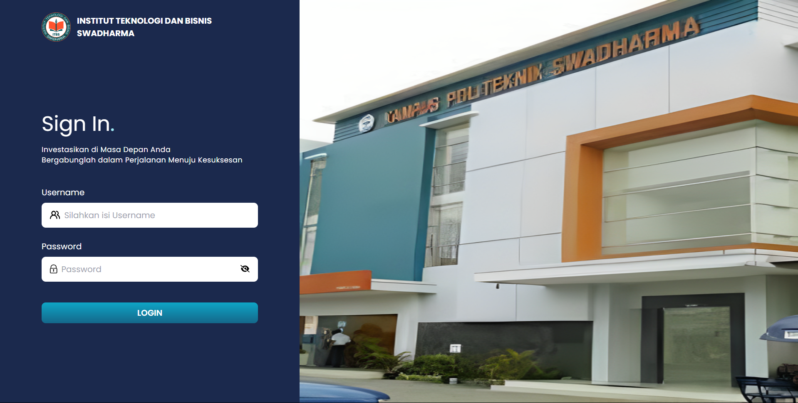
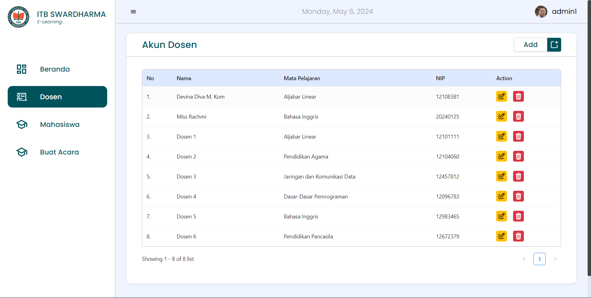
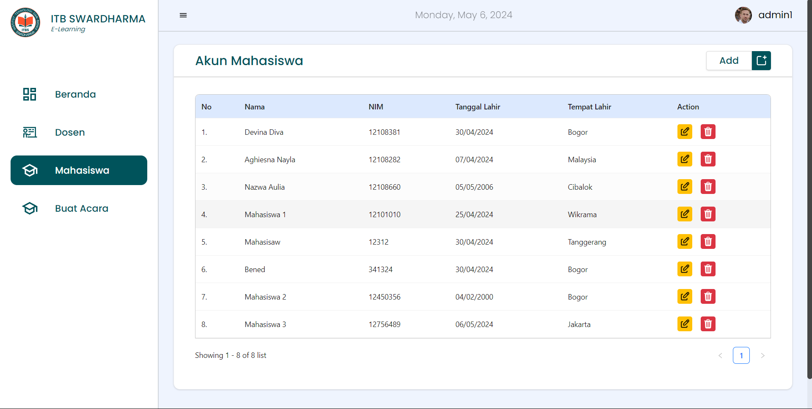
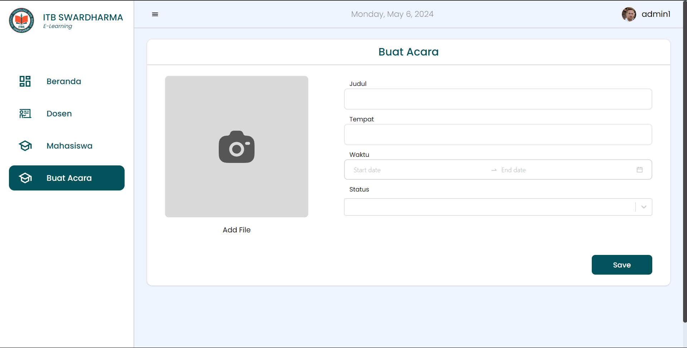
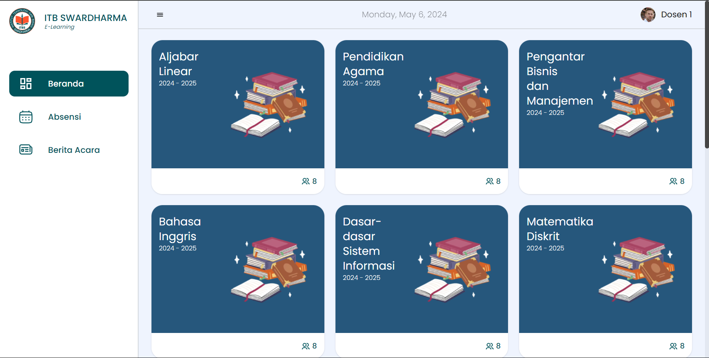
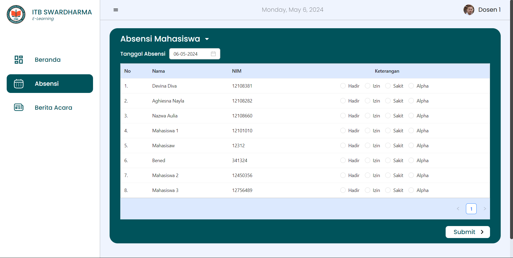
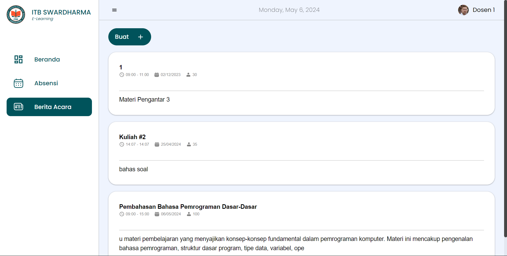
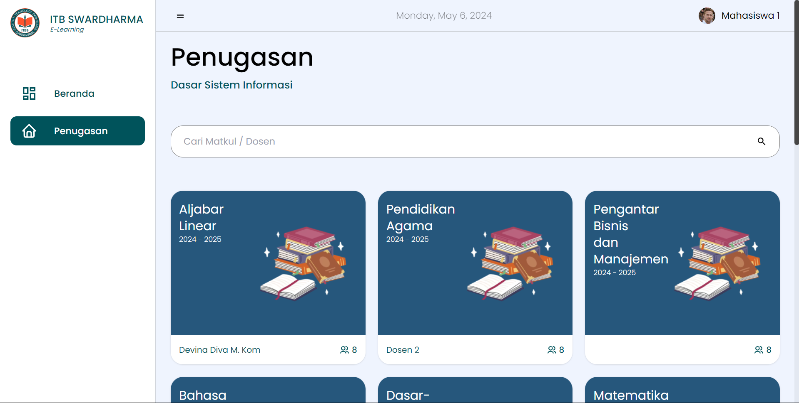

<a name="readme-top"></a>


<!-- PROJECT LOGO -->
<br />
<div align="center">
  <a href="https://github.com/Devinaasalsa/PW-Perkuliahan-Express">
    
  </a>

  <h3 align="center">ITBS Academic Management Web System</h3>

</div>


<!-- ABOUT THE PROJECT -->
## About The Project

[![Product Name Screen Shot][product-screenshot]](https://example.com)

The ITBS Academic Management Web System is a web-based application for managing student data. It serves as a platform for storing information about students and faculty members in a database. The primary purpose of the system is to facilitate academic interactions between faculty members and students, serving as a bridge for educational purposes.

<p align="right">(<a href="#readme-top">back to top</a>)</p>


### Built With

This section should list any major frameworks/libraries used to bootstrap your project. Leave any add-ons/plugins for the acknowledgements section. Here are a few examples.

* [![React][React.js]][React-url]
* [![Express][Express.com]][Express-url]
* [![Bootstrap][Bootstrap.com]][Bootstrap-url]
* [![JQuery][JQuery.com]][JQuery-url]

<p align="right">(<a href="#readme-top">back to top</a>)</p>


<!-- GETTING STARTED -->
## Getting Started

This is an example of how you may give instructions on setting up your project locally.
To get a local copy up and running follow these simple example steps.

### Prerequisites

This is an example of how to list things you need to use the software and how to install them.
* npm
  ```sh
  npm install npm@latest -g
  ```

### Installation


1. Clone the repo
   ```sh
   https://github.com/Devinaasalsa/PW-Perkuliahan-Express.git
   ```
2. Install NPM packages
   ```sh
   npm install
   ```
3. Setup the Environment Variables
   ```js
   DATABASE_URL=jdbc:mysql://localhost:3306/your_database_name
   ```

<p align="right">(<a href="#readme-top">back to top</a>)</p>


<!-- USAGE EXAMPLES -->
# SIM PERKULIAHAN

<h1>Login Page</h1>



Mengamankan akses ke halaman-halaman atau fitur-fitur tertentu yang hanya boleh diakses oleh pengguna yang sudah terdaftar dengan memasukkan informasi identifikasi, seperti username atau email, dan kata sandi (password).

<hr>

<h1>Buat Akun Dosen</h1>



Fitur yang berfungsi untuk menambahkan atau membuat informasi mengenai dosen ke dalam halaman yang khusus untuk dosen-dosen tersebut.

<hr>

<h1>Buat Akun Mahasiswa</h1>



Fitur yang berfungsi untuk menambahkan atau membuat informasi mengenai mahasiswa ke dalam halaman yang khusus untuk mahasiswa-mahasiswa tersebut.

<hr>

<h1>Buat Acara</h1>



Fitur yang berfungsi untuk menambahkan atau membuat suatu acara yang akan dilaksanakan. Sekaligus menyediakan informasi tentang tempat, waktu dan status acara yang akan dilakukan tersebut.

<br></br>

<hr>

<h1>Halaman Utama Dosen</h1>



Menampilkan berbagai mata kuliah untuk dosen dengan memaparkan judul mata kuliah serta tahun ajaran. Di dalamnya juga menyediakan daftar tugas yang sudah dibuat oleh dosen, serta dapat memberikan nilai pada mahasiswa yang sudah mengirim tugasnya.

<hr>

<h1>Absensi Mahasiswa</h1>



Fitur yang berfungsi untuk mencatat kehadiran mahasiswa setiap harinya oleh dosen yang bersangkutan. Disediakan juga fitur filter berdasarkan tanggal.

<hr>

<h1>Berita Acara</h1>


Fitur yang berfungsi untuk membuat acara untuk mahasiswa yang disediakan oleh dosen sesuai mata kuliah yang bersangkutan.

<br></br>

<hr>

<h1>Penugasan Mahasiswa</h1>


Menampikan berbagai mata kuliah yang sudah dibuat oleh Admin dengan disisipkan dosen yang bersangkutan untuk mata kuliah tersebut. Halaman tersebut juga menampilkan daftar tugas yang sudah dibuat oleh admin dan detail terkait tugas yang dibuat sehingga mahasiswa dapat mengerjakan dan mengirim ke dosen.

<br></br>


<!-- MARKDOWN LINKS & IMAGES -->
<!-- https://www.markdownguide.org/basic-syntax/#reference-style-links -->
[contributors-shield]: https://img.shields.io/github/contributors/othneildrew/Best-README-Template.svg?style=for-the-badge
[contributors-url]: https://github.com/Devinaasalsa/PW-Perkuliahan-Express/graphs/contributors
[forks-shield]: https://img.shields.io/github/forks/othneildrew/Best-README-Template.svg?style=for-the-badge
[forks-url]: https://github.com/othneildrew/Best-README-Template/network/members
[stars-shield]: https://img.shields.io/github/stars/othneildrew/Best-README-Template.svg?style=for-the-badge
[stars-url]: https://github.com/othneildrew/Best-README-Template/stargazers
[issues-shield]: https://img.shields.io/github/issues/othneildrew/Best-README-Template.svg?style=for-the-badge
[issues-url]: https://github.com/othneildrew/Best-README-Template/issues
[license-shield]: https://img.shields.io/github/license/othneildrew/Best-README-Template.svg?style=for-the-badge
[license-url]: https://github.com/othneildrew/Best-README-Template/blob/master/LICENSE.txt
[linkedin-shield]: https://img.shields.io/badge/-LinkedIn-black.svg?style=for-the-badge&logo=linkedin&colorB=555
[linkedin-url]: https://linkedin.com/in/othneildrew
[product-screenshot]: images/screenshot.png
[Next.js]: https://img.shields.io/badge/next.js-000000?style=for-the-badge&logo=nextdotjs&logoColor=white
[Next-url]: https://nextjs.org/
[React.js]: https://img.shields.io/badge/React-20232A?style=for-the-badge&logo=react&logoColor=61DAFB
[React-url]: https://reactjs.org/
[Vue.js]: https://img.shields.io/badge/Vue.js-35495E?style=for-the-badge&logo=vuedotjs&logoColor=4FC08D
[Vue-url]: https://vuejs.org/
[Angular.io]: https://img.shields.io/badge/Angular-DD0031?style=for-the-badge&logo=angular&logoColor=white
[Angular-url]: https://angular.io/
[Svelte.dev]: https://img.shields.io/badge/Svelte-4A4A55?style=for-the-badge&logo=svelte&logoColor=FF3E00
[Svelte-url]: https://svelte.dev/
[Express.com]: https://img.shields.io/badge/Expresss-FFFFFF?style=for-the-badge&logo=express&logoColor=grey
[Express-url]: https://expressjs.com/
[Bootstrap.com]: https://img.shields.io/badge/Bootstrap-563D7C?style=for-the-badge&logo=bootstrap&logoColor=white
[Bootstrap-url]: https://getbootstrap.com
[JQuery.com]: https://img.shields.io/badge/jQuery-0769AD?style=for-the-badge&logo=jquery&logoColor=white
[JQuery-url]: https://jquery.com 
